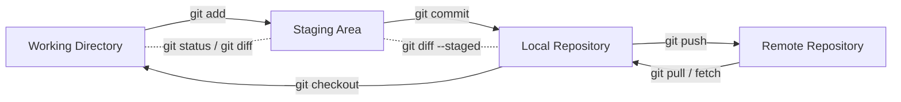
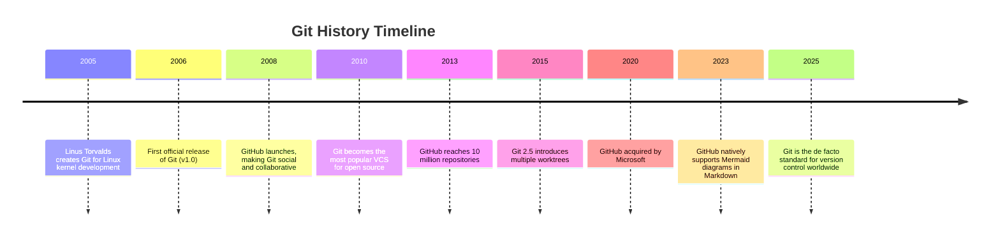
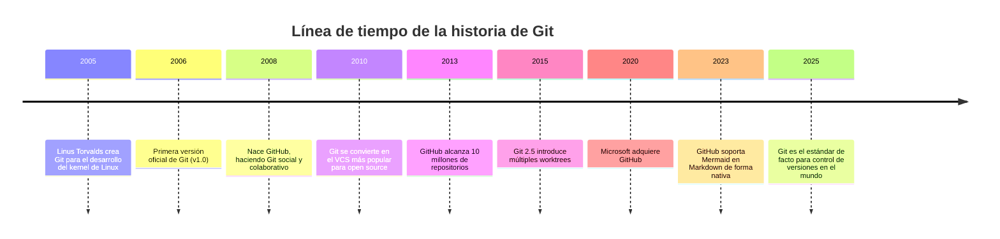

# 01 - Introduction to Git / Introducción a Git

<details>
<summary><strong>English</strong></summary>

## What is Git?
Git is a distributed version control system that allows you to track changes in your code, collaborate with others, and manage project history efficiently. It was created by Linus Torvalds in 2005 for Linux kernel development.

- **Distributed:** Every user has a full copy of the repository.
- **Fast & Reliable:** Designed for speed and data integrity.
- **Popular:** Used by millions of developers and major platforms (GitHub, GitLab, Bitbucket).

## Why use Git?
- Track every change in your project
- Collaborate with teams, even offline
- Experiment safely with branches
- Revert to previous versions easily

## Key Concepts
- **Repository (repo):** The project’s database of files and history
- **Commit:** A snapshot of your changes
- **Branch:** An independent line of development
- **Merge:** Combine changes from different branches
- **Remote:** A version of your repo hosted elsewhere (e.g., GitHub)

## History
- 2005: Git is created by Linus Torvalds
- 2008: GitHub launches, popularizing Git
- Today: Git is the de facto standard for version control


</details>

<details>
<summary><strong>Español</strong></summary>

## ¿Qué es Git?
Git es un sistema de control de versiones distribuido que te permite registrar cambios en tu código, colaborar con otros y gestionar el historial de tu proyecto de forma eficiente. Fue creado por Linus Torvalds en 2005 para el desarrollo del kernel de Linux.

- **Distribuido:** Cada usuario tiene una copia completa del repositorio.
- **Rápido y confiable:** Diseñado para velocidad e integridad de datos.
- **Popular:** Usado por millones de desarrolladores y grandes plataformas (GitHub, GitLab, Bitbucket).

## ¿Por qué usar Git?
- Registrar cada cambio en tu proyecto
- Colaborar en equipo, incluso sin conexión
- Experimentar de forma segura con ramas
- Volver fácilmente a versiones anteriores

## Conceptos clave
- **Repositorio:** Base de datos del proyecto y su historial
- **Commit:** Una instantánea de tus cambios
- **Rama (branch):** Línea independiente de desarrollo
- **Merge:** Combinar cambios de diferentes ramas
- **Remoto:** Versión del repo alojada en otro lugar (por ejemplo, GitHub)

## Historia
- 2005: Git es creado por Linus Torvalds
- 2008: Nace GitHub y populariza Git
- Hoy: Git es el estándar de facto para control de versiones


</details>

> 🚦 Start here if you are new to Git or want a refresher! / ¡Empieza aquí si eres nuevo en Git o quieres un repaso!

---

## Visual: Git Workflow (with clear edit/save loop)



**Leyenda / Legend:**
- **Working Directory:** Tus archivos locales / Your local files
- **Staging Area:** Zona de preparación antes del commit / Area to stage changes before commit
- **Local Repository:** Historial de commits en tu máquina / Commit history on your machine
- **Remote Repository:** Copia en la nube (GitHub, etc.) / Cloud copy (GitHub, etc.)

---

<details>
<summary><strong>More Details / Más Detalles</strong></summary>

<details>
<summary><strong>English</strong></summary>

### What is Git for? (Real-world uses)
- Version control for code, documents, and configuration files
- Collaboration on open source and private projects
- Automating deployments and CI/CD pipelines
- Documenting the history of changes and decisions

### How does Git work internally?
- Git stores changes as snapshots, not line-by-line diffs
- Each commit has a unique hash (SHA-1)
- The local repository is complete: you can work and view history offline
- Branches are lightweight, making it easy to experiment and merge

### Comparison with other version control systems
| Feature         | Git | SVN | Mercurial |
|----------------|-----|-----|-----------|
| Distributed    | ✔️  | ❌  | ✔️        |
| Fast branches  | ✔️  | ❌  | ✔️        |
| Popularity     | High| Med | Low       |
| Offline use    | ✔️  | ❌  | ✔️        |

### Extended Glossary
- **HEAD:** Reference to the current commit
- **Index:** Another name for the Staging Area
- **Clone:** Copy a remote repository locally
- **Fork:** Create a copy of a repo to propose changes

### Getting started (practical example)
<details>
<summary>Show example</summary>

```bash
git init
echo "Hello Git" > readme.txt
git add readme.txt
git commit -m "First commit"
```
</details>

</details>

<details>
<summary><strong>Español</strong></summary>

### ¿Para qué sirve Git? (Aplicaciones reales)
- Control de versiones para código, documentos y configuraciones
- Colaboración en proyectos open source y privados
- Automatización de despliegues y CI/CD
- Documentación del historial de cambios y decisiones

### ¿Cómo funciona Git internamente?
- Git almacena los cambios como snapshots, no como diferencias línea a línea
- Cada commit tiene un hash único (SHA-1)
- El repositorio local es completo: puedes trabajar y ver historial sin conexión
- Las ramas son ligeras, lo que facilita experimentar y fusionar

### Comparación con otros sistemas de control de versiones
| Característica  | Git | SVN | Mercurial |
|----------------|-----|-----|-----------|
| Distribuido    | ✔️  | ❌  | ✔️        |
| Ramas rápidas  | ✔️  | ❌  | ✔️        |
| Popularidad    | Alta| Media| Baja     |
| Uso offline    | ✔️  | ❌  | ✔️        |

### Glosario ampliado
- **HEAD:** Referencia al commit actual
- **Index:** Otro nombre para el Staging Area
- **Clone:** Copiar un repositorio remoto a local
- **Fork:** Crear una copia de un repo para proponer cambios

### Primeros pasos (ejemplo práctico)
<details>
<summary>Mostrar ejemplo</summary>

```bash
git init
echo "Hola Git" > readme.txt
git add readme.txt
git commit -m "Primer commit"
```
</details>

</details>
</details>

<details>
<summary><strong>Git History Timeline / Línea de tiempo de la historia de Git</strong></summary>





</details>
