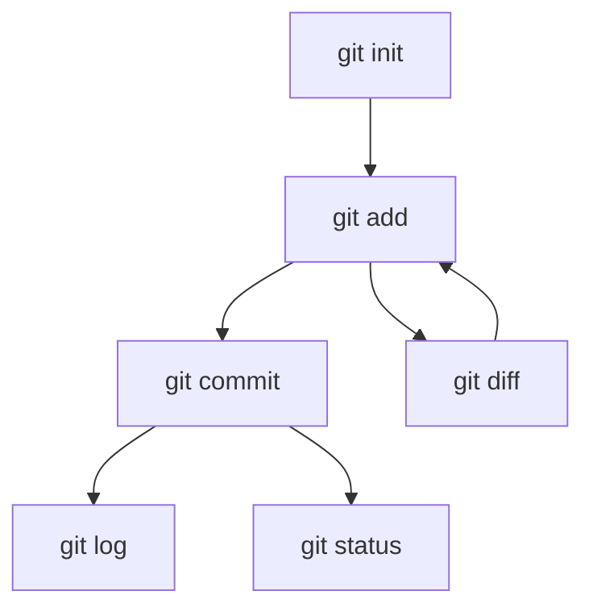

# 02 - Basic Git Commands / Comandos básicos de Git

<details>
<summary><strong>English</strong></summary>

## Essential Commands (with Details)

| Command | Description |
|---------|-------------|
| `git init` | Initialize a new Git repository. Creates a `.git` folder with all metadata and history. Run this in the root of your project. |
| `git add <file>` | Stage file(s) for commit. Moves changes from the working directory to the staging area (index). Use `git add .` to stage all changes, or `git add -p` to interactively stage hunks. |
| `git commit -m "msg"` | Save staged changes to the local repository. Creates a new commit object with a unique hash. Use clear, descriptive messages. |
| `git status` | Show the status of the working directory and staging area. Tells you which files are staged, unstaged, or untracked, and what actions to take. |
| `git log` | Show commit history. Use `--oneline`, `--graph`, or `--stat` for different views. |
| `git diff` | Show changes not yet staged/committed. Use `git diff --staged` to see staged changes. |

## The Staging Area (Index)
- The staging area lets you prepare exactly what will go into your next commit.
- You can stage individual files or even specific lines (`git add -p`).
- Use `git diff` to see unstaged changes, and `git diff --staged` to see staged changes.

## Undoing Changes (with Safety)
- `git checkout -- <file>`: Discard changes in the working directory (use `git restore <file>` in newer Git).
- `git reset HEAD <file>`: Unstage a file (move from staging area back to working directory).
- `git revert <commit>`: Create a new commit that undoes a previous one (safe for shared repos).
- `git reset --hard <commit>`: Reset repo and working directory to a commit (dangerous! deletes changes).
- `git clean -fd`: Remove untracked files and directories (irreversible!).

## Viewing History
- `git log --oneline --graph --all`: Visualize branch history with a compact graph.
- `git show <commit>`: Show details and diff for a specific commit.
- `git log --stat`: Show files changed in each commit.
- `git log -p`: Show patch (diff) for each commit.

## Practical Example: Typical Workflow
```bash
git init
echo "Hello" > hello.txt
git add hello.txt
git status
git commit -m "Add hello.txt"
echo "World" >> hello.txt
git diff
git add hello.txt
git commit -m "Update hello.txt"
git log --oneline
```

## Visual: Command Flow


## Common Mistakes
- Forgetting to add files before commit (check with `git status`)
- Committing with a vague message (always describe what/why)
- Using `reset --hard` or `clean` without caution (can lose data)
- Not pulling before pushing (can cause conflicts)

</details>

<details>
<summary><strong>Español</strong></summary>

## Comandos esenciales (con detalles)

| Comando | Descripción |
|---------|-------------|
| `git init` | Inicializa un nuevo repositorio Git. Crea la carpeta `.git` con todo el historial y metadatos. Ejecuta esto en la raíz de tu proyecto. |
| `git add <archivo>` | Prepara archivo(s) para el commit. Mueve cambios del directorio de trabajo al área de preparación (index). Usa `git add .` para todos los cambios, o `git add -p` para seleccionar líneas. |
| `git commit -m "msg"` | Guarda los cambios preparados en el repo local. Crea un nuevo commit con un hash único. Usa mensajes claros y descriptivos. |
| `git status` | Muestra el estado del directorio de trabajo y el área de preparación. Indica qué archivos están preparados, sin preparar o sin seguimiento, y qué acciones tomar. |
| `git log` | Muestra el historial de commits. Usa `--oneline`, `--graph` o `--stat` para diferentes vistas. |
| `git diff` | Muestra cambios no preparados/confirmados. Usa `git diff --staged` para ver los cambios preparados. |

## Área de preparación (Index)
- El área de preparación te permite elegir exactamente qué irá en tu próximo commit.
- Puedes preparar archivos individuales o líneas específicas (`git add -p`).
- Usa `git diff` para ver cambios no preparados y `git diff --staged` para los preparados.

## Deshacer cambios (con seguridad)
- `git checkout -- <archivo>`: Descarta cambios en el directorio de trabajo (en Git moderno, usa `git restore <archivo>`).
- `git reset HEAD <archivo>`: Quita un archivo del área de preparación (vuelve al directorio de trabajo).
- `git revert <commit>`: Crea un commit que revierte uno anterior (seguro para repos compartidos).
- `git reset --hard <commit>`: Restaura repo y archivos a un commit (¡peligroso! borra cambios).
- `git clean -fd`: Elimina archivos y carpetas no seguidos (¡irreversible!).

## Ver historial
- `git log --oneline --graph --all`: Visualiza el historial de ramas en forma compacta.
- `git show <commit>`: Muestra detalles y diff de un commit específico.
- `git log --stat`: Muestra archivos cambiados en cada commit.
- `git log -p`: Muestra el parche (diff) de cada commit.

## Ejemplo práctico: Flujo típico
```bash
git init
echo "Hola" > hola.txt
git add hola.txt
git status
git commit -m "Agregar hola.txt"
echo "Mundo" >> hola.txt
git diff
git add hola.txt
git commit -m "Actualizar hola.txt"
git log --oneline
```

## Visual: Flujo de comandos


## Errores comunes
- Olvidar agregar archivos antes del commit (verifica con `git status`)
- Hacer commits con mensajes poco claros (describe siempre qué y por qué)
- Usar `reset --hard` o `clean` sin precaución (puedes perder datos)
- No hacer pull antes de push (puede causar conflictos)

</details>

---

## Practical Exercises / Ejercicios Prácticos

<details>
<summary><strong>English</strong></summary>

**Exercise 1:** Initialize a new repository, add a file, and commit it.
<details><summary>Solution</summary>

```bash
git init
echo "Hello Git" > file.txt
git add file.txt
git commit -m "Initial commit"
```
</details>

**Exercise 2:** Make a change to the file, view the diff, and commit the update.
<details><summary>Solution</summary>

```bash
echo "More content" >> file.txt
git diff
git add file.txt
git commit -m "Update file.txt"
```
</details>

**Exercise 3:** Undo a staged change before committing.
<details><summary>Solution</summary>

```bash
echo "Oops" >> file.txt
git add file.txt
git reset HEAD file.txt
```
</details>

</details>

<details>
<summary><strong>Español</strong></summary>

**Ejercicio 1:** Inicializa un nuevo repositorio, agrega un archivo y haz commit.
<details><summary>Solución</summary>

```bash
git init
echo "Hola Git" > archivo.txt
git add archivo.txt
git commit -m "Commit inicial"
```
</details>

**Ejercicio 2:** Modifica el archivo, visualiza el diff y haz commit del cambio.
<details><summary>Solución</summary>

```bash
echo "Más contenido" >> archivo.txt
git diff
git add archivo.txt
git commit -m "Actualizar archivo.txt"
```
</details>

**Ejercicio 3:** Deshaz un cambio preparado antes de hacer commit.
<details><summary>Solución</summary>

```bash
echo "Ups" >> archivo.txt
git add archivo.txt
git reset HEAD archivo.txt
```
</details>

</details>

---

## FAQ / Preguntas Frecuentes

<details>
<summary><strong>English</strong></summary>

- **Why does `git commit` say 'nothing to commit'?**
  - You haven't staged any changes. Use `git add` first.
- **How do I undo the last commit?**
  - `git reset --soft HEAD~1` (keeps changes staged) or `git reset --hard HEAD~1` (deletes changes).
- **How do I remove untracked files?**
  - `git clean -fd` (be careful, this is irreversible).
- **How do I see what will be committed?**
  - Use `git status` and `git diff --staged`.

</details>
<details>
<summary><strong>Español</strong></summary>

- **¿Por qué `git commit` dice 'nothing to commit'?**
  - No has preparado cambios. Usa primero `git add`.
- **¿Cómo deshago el último commit?**
  - `git reset --soft HEAD~1` (mantiene los cambios preparados) o `git reset --hard HEAD~1` (borra los cambios).
- **¿Cómo elimino archivos no seguidos?**
  - `git clean -fd` (cuidado, es irreversible).
- **¿Cómo veo qué se va a commitear?**
  - Usa `git status` y `git diff --staged`.

</details>

---

## File States Visualization / Visualización de Estados de Archivos

| Action                | Untracked | Staged | Committed |
|-----------------------|-----------|--------|-----------|
| Create new file       |    ✔️     |        |           |
| git add               |           |   ✔️   |           |
| git commit            |           |        |    ✔️     |
| Edit file             |    ✔️     |        |           |
| git add (after edit)  |           |   ✔️   |           |

---

## Productivity Tips / Consejos de Productividad

- Use `git config --global alias.co checkout` to create command aliases (e.g., `git co` for `checkout`).
- Use tab completion in your terminal for faster command entry.
- Integrate Git with your editor (VS Code, Sublime, etc.) for visual diffs and staging.
- Use `git log --oneline --graph --decorate` for a visual branch history.
- Use `.gitignore` to avoid tracking unnecessary files.

- Usa `git config --global alias.co checkout` para crear alias de comandos (ej: `git co` para `checkout`).
- Usa el autocompletado con tabulador en la terminal para escribir comandos más rápido.
- Integra Git con tu editor (VS Code, Sublime, etc.) para ver diferencias y preparar cambios de forma visual.
- Usa `git log --oneline --graph --decorate` para ver el historial de ramas de forma visual.
- Usa `.gitignore` para evitar trackear archivos innecesarios.

---

## Compatibility Notes / Notas de Compatibilidad

- On Windows, use double quotes for commit messages: `git commit -m "msg"`.
- Line endings may differ (LF vs CRLF); configure with `git config --global core.autocrlf`.
- Some commands (`git restore`) require Git 2.23+.
- File permissions may behave differently on Windows vs Linux/Mac.


- En Windows, usa comillas dobles para los mensajes de commit: `git commit -m "msg"`.
- Los finales de línea pueden diferir (LF vs CRLF); configura con `git config --global core.autocrlf`.
- Algunos comandos (`git restore`) requieren Git 2.23+.
- Los permisos de archivos pueden comportarse diferente en Windows vs Linux/Mac.

---

## References / Referencias

- [Official Git Documentation](https://git-scm.com/doc)
- [Pro Git Book (free)](https://git-scm.com/book/en/v2)
- [GitHub Docs](https://docs.github.com/en/get-started/using-git)
- [Atlassian Git Tutorials](https://www.atlassian.com/git/tutorials)
- [Cheat Sheet (GitHub)](https://education.github.com/git-cheat-sheet-education.pdf)

---
