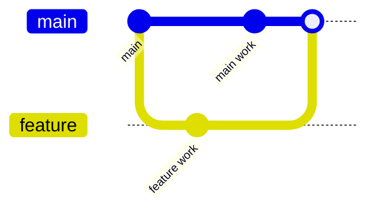
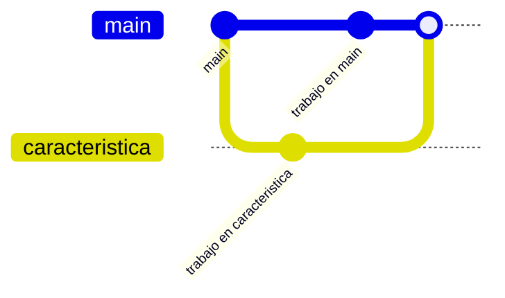
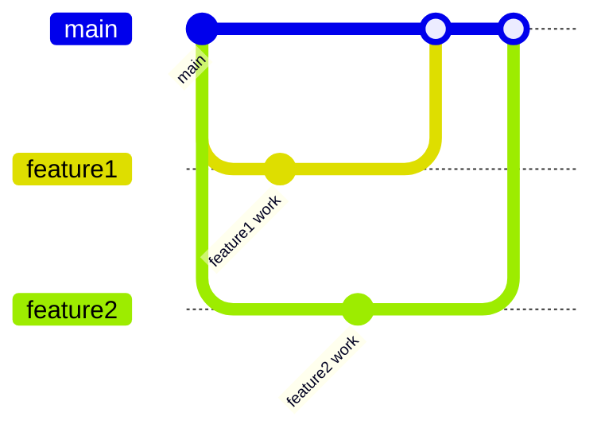
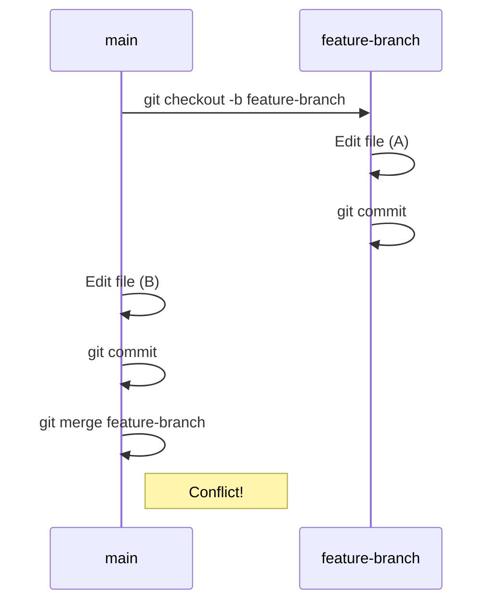
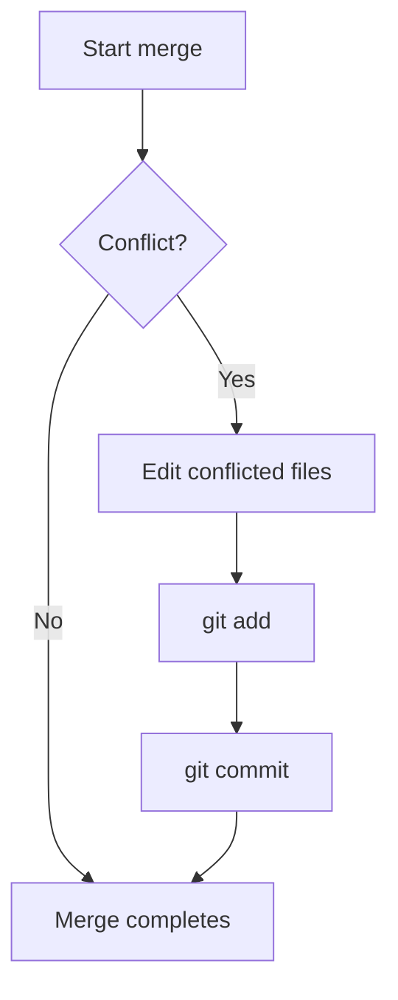

# 03 - Branching & Merging / Ramas y Fusiones

<details>
<summary><strong>English</strong></summary>

## Theory: What Are Branches and Merges?
- **Branch**: A movable pointer to a commit. Allows parallel development and experimentation.
- **Merging**: Combines changes from one branch into another. Maintains project history.
- **Rebasing**: Moves or combines a sequence of commits to a new base commit. Useful for linear history.

## Essential Commands
| Command | Description |
|---------|-------------|
| `git branch` | List all branches. Use `-a` for remote branches. |
| `git branch <name>` | Create a new branch. |
| `git checkout <name>` | Switch to a branch. |
| `git switch <name>` | Modern alternative to checkout for switching. |
| `git checkout -b <name>` | Create and switch to a new branch. |
| `git switch -c <name>` | Modern alternative to create and switch. |
| `git merge <name>` | Merge branch `<name>` into current branch. |
| `git rebase <name>` | Rebase current branch onto `<name>`. |
| `git branch -d <name>` | Delete a branch (safe, merged). |
| `git branch -D <name>` | Force delete a branch. |

## Visual: Branching and Merging


## Practical Example: Feature Branch Workflow
```bash
git checkout -b feature-x
# Make changes
git add .
git commit -m "Work on feature X"
git checkout main
git merge feature-x
```

## Best Practices
- Use descriptive branch names (e.g., `feature/login`, `bugfix/header`)
- Keep branches focused and short-lived
- Regularly pull/rebase to avoid large conflicts
- Delete merged branches to keep repo clean

## Common Mistakes
- Working on the wrong branch
- Forgetting to commit before switching
- Merging without reviewing conflicts
- Rebasing shared branches (can rewrite history!)

</details>

<details>
<summary><strong>Español</strong></summary>

## Teoría: ¿Qué son las ramas y fusiones?
- **Rama**: Un puntero móvil a un commit. Permite desarrollo paralelo y experimentación.
- **Fusión (merge)**: Combina cambios de una rama en otra. Mantiene el historial del proyecto.
- **Rebase**: Mueve o combina una secuencia de commits a una nueva base. Útil para un historial lineal.

## Comandos esenciales
| Comando | Descripción |
|---------|-------------|
| `git branch` | Lista todas las ramas. Usa `-a` para remotas. |
| `git branch <nombre>` | Crea una nueva rama. |
| `git checkout <nombre>` | Cambia a una rama. |
| `git switch <nombre>` | Alternativa moderna para cambiar de rama. |
| `git checkout -b <nombre>` | Crea y cambia a una nueva rama. |
| `git switch -c <nombre>` | Alternativa moderna para crear y cambiar. |
| `git merge <nombre>` | Fusiona la rama `<nombre>` en la actual. |
| `git rebase <nombre>` | Rebasea la rama actual sobre `<nombre>`. |
| `git branch -d <nombre>` | Elimina una rama (seguro, ya fusionada). |
| `git branch -D <nombre>` | Fuerza la eliminación de una rama. |

## Visual: Ramas y Fusiones


## Ejemplo práctico: Flujo de rama de característica
```bash
git checkout -b caracteristica-x
# Realiza cambios
git add .
git commit -m "Trabajo en caracteristica X"
git checkout main
git merge caracteristica-x
```

## Mejores prácticas
- Usa nombres descriptivos para las ramas (ej: `feature/login`, `bugfix/header`)
- Mantén las ramas enfocadas y de corta duración
- Haz pull/rebase regularmente para evitar grandes conflictos
- Elimina ramas fusionadas para mantener limpio el repo

## Errores comunes
- Trabajar en la rama equivocada
- Olvidar hacer commit antes de cambiar de rama
- Fusionar sin revisar conflictos
- Rebasear ramas compartidas (¡puede reescribir el historial!)

</details>

---

## Practical Exercises / Ejercicios Prácticos
<details>
<summary><strong>English</strong></summary>

**Exercise 1:** Create a branch, make a change, and merge it into main.
<details><summary>Solution</summary>

```bash
git checkout -b test-branch
echo "Branching!" > branch.txt
git add branch.txt
git commit -m "Add branch.txt"
git checkout main
git merge test-branch
```
</details>

**Exercise 2:** Simulate a merge conflict and resolve it.
<details><summary>Solution</summary>

```bash
git checkout -b conflict-branch
echo "A" > conflict.txt
git add conflict.txt
git commit -m "A in branch"
git checkout main
echo "B" > conflict.txt
git add conflict.txt
git commit -m "B in main"
git merge conflict-branch
# Edit conflict.txt to resolve, then:
git add conflict.txt
git commit -m "Resolve conflict"
```
</details>

</details>
<details>
<summary><strong>Español</strong></summary>

**Ejercicio 1:** Crea una rama, haz un cambio y fusiónalo en main.
<details><summary>Solución</summary>

```bash
git checkout -b rama-prueba
echo "¡Ramas!" > rama.txt
git add rama.txt
git commit -m "Agregar rama.txt"
git checkout main
git merge rama-prueba
```
</details>

**Ejercicio 2:** Simula un conflicto de fusión y resuélvelo.
<details><summary>Solución</summary>

```bash
git checkout -b rama-conflicto
echo "A" > conflicto.txt
git add conflicto.txt
git commit -m "A en rama"
git checkout main
echo "B" > conflicto.txt
git add conflicto.txt
git commit -m "B en main"
git merge rama-conflicto
# Edita conflicto.txt para resolver, luego:
git add conflicto.txt
git commit -m "Resolver conflicto"
```
</details>

</details>

---

## FAQ / Preguntas Frecuentes
<details>
<summary><strong>English</strong></summary>

- **What's the difference between merge and rebase?**
  
  Merge preserves history, rebase creates a linear history.

- **How do I delete a branch after merging?**
  
  `git branch -d <name>`

- **How do I resolve a merge conflict?**
  
  Edit the conflicted file, stage it, and commit.

- **Can I rebase a branch shared with others?**
  
  Not recommended; it rewrites history.

</details>
<details>
<summary><strong>Español</strong></summary>

- **¿Cuál es la diferencia entre merge y rebase?**
  
  Merge preserva el historial, rebase lo hace lineal.

- **¿Cómo elimino una rama tras fusionar?**
  
  `git branch -d <nombre>`

- **¿Cómo resuelvo un conflicto de fusión?**
  
  Edita el archivo en conflicto, prepáralo y haz commit.

- **¿Puedo rebasear una rama compartida?**
  
  No es recomendable; reescribe el historial.

</details>

---

## Visualizations / Visualizaciones

### Branching Example / Ejemplo de ramas


### Merge Conflict Example / Ejemplo de conflicto


---

## Productivity Tips / Consejos de Productividad
<details>
<summary><strong>English</strong></summary>

- Use `git log --graph --oneline --all` to visualize branches.
- Use `git stash` to save work before switching branches.
- Use branch naming conventions for clarity.
- Integrate with visual tools (e.g., GitKraken, VS Code Source Control).

</details>
<details>
<summary><strong>Español</strong></summary>

- Usa `git log --graph --oneline --all` para visualizar ramas.
- Usa `git stash` para guardar tu trabajo antes de cambiar de rama.
- Usa convenciones de nombres para claridad.
- Integra con herramientas visuales (ej: GitKraken, control de código fuente de VS Code).

</details>

---

## Compatibility Notes / Notas de Compatibilidad
<details>
<summary><strong>English</strong></summary>

- `git switch` and `git restore` require Git 2.23+.
- Branch names are case-sensitive on Linux, not on Windows.
- Some merge tools may behave differently by OS.

</details>
<details>
<summary><strong>Español</strong></summary>

- `git switch` y `git restore` requieren Git 2.23+.
- Los nombres de ramas distinguen mayúsculas/minúsculas en Linux, no en Windows.
- Algunas herramientas de fusión pueden comportarse diferente según el sistema operativo.

</details>

---

## Real-World Scenarios & Anti-patterns / Escenarios Reales y Anti-patrones
<details>
<summary><strong>English</strong></summary>

### Real-World Branching Scenarios
- **Feature Branching:** Each new feature is developed in its own branch, then merged into main when complete.
- **Hotfix Branch:** For urgent bug fixes, create a branch from main, fix, then merge back and deploy.
- **Release Branch:** Prepare a release in a dedicated branch, allowing only bug fixes and documentation changes.

### Anti-patterns
- Long-lived branches that diverge too much from main.
- Vague branch names (e.g., `test`, `stuff`).
- Merging without reviewing or testing.
- Rebasing public/shared branches.

</details>
<details>
<summary><strong>Español</strong></summary>

### Escenarios reales de ramas
- **Rama de característica:** Cada nueva funcionalidad se desarrolla en su propia rama y se fusiona a main al terminar.
- **Rama de hotfix:** Para bugs urgentes, crea una rama desde main, corrige y fusiona de vuelta para desplegar.
- **Rama de release:** Prepara una versión en una rama dedicada, permitiendo solo correcciones y documentación.

### Anti-patrones
- Ramas que viven mucho tiempo y se alejan de main.
- Nombres de ramas poco claros (ej: `prueba`, `cosas`).
- Fusionar sin revisar ni probar.
- Rebasear ramas públicas o compartidas.

</details>

---

## Conflict Resolution Flow / Flujo de Resolución de Conflictos


---

## Advanced Tips / Consejos Avanzados
<details>
<summary><strong>English</strong></summary>

- Use `git cherry-pick <commit>` to apply a specific commit from another branch.
- Use `git reflog` to recover lost commits or branches.
- Use `git branch -vv` to see tracking info and last commit per branch.
- Try visual tools like GitKraken, Sourcetree, or VS Code extensions for easier branch management.

</details>
<details>
<summary><strong>Español</strong></summary>

- Usa `git cherry-pick <commit>` para aplicar un commit específico de otra rama.
- Usa `git reflog` para recuperar commits o ramas perdidas.
- Usa `git branch -vv` para ver información de seguimiento y último commit por rama.
- Prueba herramientas visuales como GitKraken, Sourcetree o extensiones de VS Code para gestionar ramas fácilmente.

</details>

---

## References / Referencias
- [Official Git Branching Docs](https://git-scm.com/book/en/v2/Git-Branching-Branches-in-a-Nutshell)
- [Atlassian Branching Guide](https://www.atlassian.com/git/tutorials/using-branches)
- [Pro Git Book: Branching](https://git-scm.com/book/en/v2/Git-Branching-Branching-Workflows)
- [GitHub Docs: Branches](https://docs.github.com/en/get-started/using-git/about-branches)

---

## Interactive Resources / Recursos Visuales e Interactivos
- [Atlassian Git Branching Video (EN)](https://www.youtube.com/watch?v=FyAAIHHClqI)
- [Git Branching Interactive Tutorial (EN)](https://learngitbranching.js.org/)
- [GitHub Learning Lab (EN)](https://lab.github.com/)
