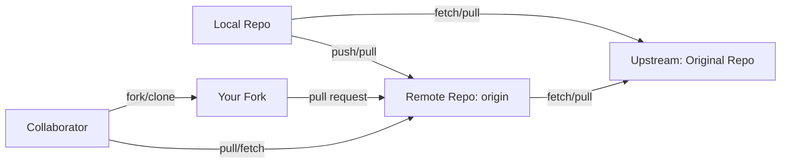
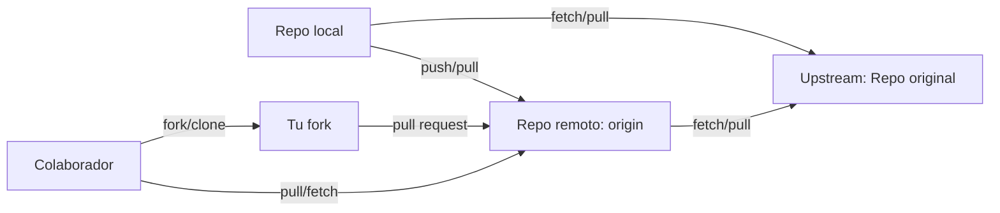
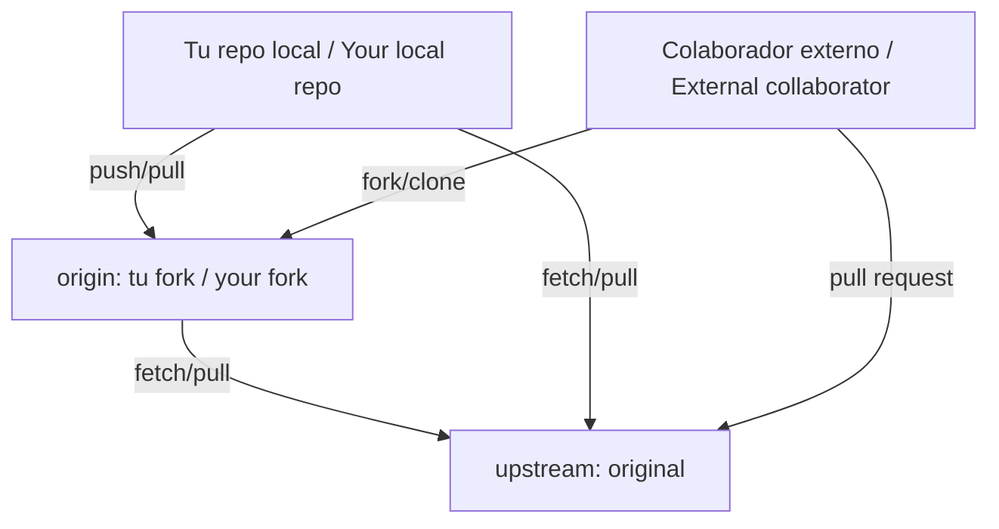

# 04 - Remote Repositories / Repositorios Remotos

<details>
<summary><strong>English</strong></summary>

## Theory: What Are Remote Repositories?
- A remote repository is a version of your project hosted on the internet or network (e.g., GitHub, GitLab, Bitbucket).
- Enables collaboration, backup, and distributed workflows.
- Common remotes: `origin` (default), `upstream` (original repo when forking).
- **Tracking Branches:** When you clone a repository, Git automatically sets up your local branches to track remote branches. This means you can use simple commands like `git pull` and `git push` without specifying the remote and branch every time.
- **origin vs. upstream:** `origin` is the default name for your main remote, usually your own fork or the repository you cloned from. `upstream` is typically used to refer to the original repository from which you forked.
- **Remote URLs:** Remotes can use HTTPS or SSH URLs. SSH is recommended for frequent contributors as it avoids repeated authentication prompts.
- **Distributed Collaboration:** Multiple people can work on the same project from different locations, each with their own local and remote repositories.

## Essential Commands
| Command | Description |
|---------|-------------|
| `git remote -v` | List remotes and their URLs. Useful to verify your remotes. |
| `git remote add <name> <url>` | Add a new remote. Use this to connect your local repo to a new remote, e.g., after forking. |
| `git clone <url>` | Copy a remote repository locally. Sets up `origin` by default. |
| `git fetch <remote>` | Download new data from remote (no merge). Keeps your local repo up to date without changing your working files. |
| `git pull <remote> <branch>` | Fetch and merge changes from remote branch. Combines `fetch` and `merge` in one step. |
| `git push <remote> <branch>` | Upload local commits to remote branch. Shares your changes with collaborators. |
| `git remote remove <name>` | Remove a remote. Useful if a remote is no longer needed. |
| `git remote rename <old> <new>` | Rename a remote. Helpful for clarity or convention. |
| `git branch -u <remote>/<branch>` | Set upstream branch for tracking. |
| `git remote set-url <name> <newurl>` | Change the URL of an existing remote. |

## Visual: Remote Workflow


## Practical Example: Collaborating with Remotes
```bash
git clone https://github.com/user/repo.git # Clone the repository
git remote -v # Check remotes
git remote add upstream https://github.com/original/repo.git # Add upstream remote
git fetch upstream # Fetch changes from upstream
git checkout main # Switch to main branch
git merge upstream/main # Merge upstream changes
git push origin main # Push to your fork
```
- **Resolving Conflicts:** If you encounter conflicts during merge, Git will mark the files. Edit them to resolve, then use `git add <file>` and `git commit` to complete the merge.
- **Syncing Forks:** Regularly fetch and merge from `upstream` to keep your fork up to date.

## Best Practices
- Always pull before pushing to avoid conflicts.
- Use clear branch names for collaboration (e.g., `feature/login-page`, `bugfix/typo-header`).
- Set up `upstream` when working with forks to easily sync with the original project.
- Protect main branches with branch protection rules to prevent force pushes and require reviews.
- Use Pull Requests (PRs) for code review and discussion before merging changes.
- Regularly prune old branches with `git remote prune <remote>`.
- Use SSH keys for secure authentication.

## Common Mistakes
- Forgetting to pull before pushing (causes rejected pushes and conflicts).
- Pushing to the wrong branch or remote (double-check before pushing).
- Not setting upstream for forks, making it harder to sync with the original repo.
- Overwriting remote history with `--force` (use with caution, prefer `--force-with-lease`).
- Not reviewing changes before pushing or merging.
- Ignoring merge conflicts instead of resolving them carefully.

</details>

<details>
<summary><strong>Español</strong></summary>

## Teoría: ¿Qué son los repositorios remotos?
- Un repositorio remoto es una versión de tu proyecto alojada en internet o red (ej: GitHub, GitLab, Bitbucket).
- Permite colaboración, respaldo y flujos distribuidos.
- Remotos comunes: `origin` (por defecto), `upstream` (repo original al hacer fork).
- **Ramas de seguimiento (tracking branches):** Al clonar un repositorio, Git configura tus ramas locales para rastrear ramas remotas, permitiendo usar comandos simples como `git pull` y `git push`.
- **origin vs. upstream:** `origin` es el nombre por defecto del remoto principal, normalmente tu propio fork o el repo que clonaste. `upstream` suele referirse al repositorio original del que hiciste fork.
- **URLs remotas:** Los remotos pueden usar URLs HTTPS o SSH. SSH es recomendable para colaboradores frecuentes.
- **Colaboración distribuida:** Varias personas pueden trabajar en el mismo proyecto desde diferentes ubicaciones, cada una con su propio repositorio local y remoto.

## Comandos esenciales
| Comando | Descripción |
|---------|-------------|
| `git remote -v` | Lista remotos y sus URLs. Útil para verificar tus remotos. |
| `git remote add <nombre> <url>` | Agrega un nuevo remoto. Útil tras hacer fork. |
| `git clone <url>` | Copia un repo remoto localmente. Configura `origin` por defecto. |
| `git fetch <remoto>` | Descarga datos nuevos del remoto (sin mezclar). Mantiene tu repo actualizado sin modificar archivos de trabajo. |
| `git pull <remoto> <rama>` | Descarga y fusiona cambios de una rama remota. Combina `fetch` y `merge`. |
| `git push <remoto> <rama>` | Sube commits locales a una rama remota. Comparte tus cambios. |
| `git remote remove <nombre>` | Elimina un remoto. Útil si ya no lo necesitas. |
| `git remote rename <viejo> <nuevo>` | Renombra un remoto. Para mayor claridad. |
| `git branch -u <remoto>/<rama>` | Configura la rama de seguimiento. |
| `git remote set-url <nombre> <nuevaurl>` | Cambia la URL de un remoto existente. |

## Visual: Flujo de trabajo con remotos


## Ejemplo práctico: Colaborando con remotos
```bash
git clone https://github.com/usuario/repo.git # Clona el repositorio
git remote -v # Verifica remotos
git remote add upstream https://github.com/original/repo.git # Agrega remoto upstream
git fetch upstream # Descarga cambios de upstream
git checkout main # Cambia a la rama principal
git merge upstream/main # Fusiona cambios de upstream
git push origin main # Sube a tu fork
```
- **Resolución de conflictos:** Si hay conflictos al fusionar, Git marcará los archivos. Edítalos para resolver, luego usa `git add <archivo>` y `git commit` para completar la fusión.
- **Sincronizar forks:** Haz fetch y merge regularmente desde `upstream` para mantener tu fork actualizado.

## Mejores prácticas
- Haz pull antes de hacer push para evitar conflictos.
- Usa nombres claros de ramas para colaborar (ej: `feature/login-page`, `bugfix/typo-header`).
- Configura `upstream` al trabajar con forks para sincronizar fácilmente con el proyecto original.
- Protege ramas principales con reglas de protección para evitar force push y requerir revisiones.
- Usa Pull Requests (PRs) para revisión y discusión antes de fusionar cambios.
- Prunea ramas viejas con `git remote prune <remoto>`.
- Usa llaves SSH para autenticación segura.

## Errores comunes
- Olvidar hacer pull antes de push (causa rechazos y conflictos).
- Hacer push a la rama o remoto equivocado (verifica antes de subir).
- No configurar upstream en forks, dificultando la sincronización.
- Sobrescribir el historial remoto con `--force` (usa mejor `--force-with-lease`).
- No revisar los cambios antes de hacer push o merge.
- Ignorar conflictos de fusión en vez de resolverlos cuidadosamente.

</details>

---

## Practical Exercises / Ejercicios Prácticos
<details>
<summary><strong>English</strong></summary>

**Exercise 1:** Clone a repository and add a new remote.
<details><summary>Solution</summary>

```bash
git clone https://github.com/example/repo.git
cd repo
git remote add upstream https://github.com/original/repo.git
git remote -v # Check that both origin and upstream are listed
```
- After adding `upstream`, you can fetch updates from the original repository and keep your fork in sync.
</details>

**Exercise 2:** Fetch and merge changes from upstream.
<details><summary>Solution</summary>

```bash
git fetch upstream # Download changes from upstream
git checkout main # Switch to main branch
git merge upstream/main # Merge upstream changes into your branch
```
- If there are conflicts, resolve them as indicated by Git, then commit the result.
</details>

**Exercise 3:** Push your changes to your fork.
<details><summary>Solution</summary>

```bash
git push origin main # Push your local changes to your fork
```
- This makes your changes available on your remote fork for others to review or for PRs.
</details>

</details>
<details>
<summary><strong>Español</strong></summary>

**Ejercicio 1:** Clona un repositorio y agrega un remoto nuevo.
<details><summary>Solución</summary>

```bash
git clone https://github.com/ejemplo/repo.git
cd repo
git remote add upstream https://github.com/original/repo.git
git remote -v # Verifica que estén origin y upstream
```
- Tras agregar `upstream`, puedes descargar actualizaciones del repositorio original y mantener tu fork sincronizado.
</details>

**Ejercicio 2:** Descarga y fusiona cambios de upstream.
<details><summary>Solución</summary>

```bash
git fetch upstream # Descarga cambios de upstream
git checkout main # Cambia a la rama principal
git merge upstream/main # Fusiona cambios de upstream en tu rama
```
- Si hay conflictos, resuélvelos como indica Git y haz commit del resultado.
</details>

**Ejercicio 3:** Sube tus cambios a tu fork.
<details><summary>Solución</summary>

```bash
git push origin main # Sube tus cambios locales a tu fork
```
- Así tus cambios estarán disponibles en tu fork remoto para revisión o PRs.
</details>

</details>

---

## FAQ / Preguntas Frecuentes
<details>
<summary><strong>English</strong></summary>

- **What is `origin`?**
  
  The default name for your main remote repository, usually your fork or the repository you cloned from.

- **What is `upstream`?**
  
  The original repository you forked from (used in open source collaboration). Adding `upstream` allows you to fetch and merge updates from the source project.

- **How do I sync my fork with the original repo?**
  
  Add `upstream`, fetch, then merge or rebase: `git fetch upstream && git merge upstream/main`. This keeps your fork up to date with the latest changes.

- **What happens if I push to the wrong branch?**
  
  You may need to reset or revert. Always check your branch before pushing. Use `git log` and `git status` to verify.

- **How do I resolve merge conflicts?**
  
  Git will mark conflicting files. Open them, resolve the conflicts, then `git add <file>` and `git commit` to complete the merge.

- **Can I have multiple remotes?**
  
  Yes, you can add as many remotes as needed (e.g., for different forks or deployment targets).

- **How do I change a remote URL?**
  
  Use `git remote set-url <name> <newurl>` to update the URL for a remote.

</details>
<details>
<summary><strong>Español</strong></summary>

- **¿Qué es `origin`?**
  
  El nombre por defecto del repositorio remoto principal, normalmente tu fork o el repo que clonaste.

- **¿Qué es `upstream`?**
  
  El repositorio original del que hiciste fork (usado en colaboración open source). Agregar `upstream` te permite descargar y fusionar actualizaciones del proyecto fuente.

- **¿Cómo sincronizo mi fork con el repo original?**
  
  Agrega `upstream`, haz fetch y luego merge o rebase: `git fetch upstream && git merge upstream/main`. Así mantienes tu fork actualizado.

- **¿Qué pasa si hago push a la rama equivocada?**
  
  Puede que debas resetear o revertir. Siempre revisa tu rama antes de hacer push. Usa `git log` y `git status` para verificar.

- **¿Cómo resuelvo conflictos de fusión?**
  
  Git marcará los archivos en conflicto. Ábrelos, resuelve los conflictos, luego `git add <archivo>` y `git commit` para completar la fusión.

- **¿Puedo tener varios remotos?**
  
  Sí, puedes agregar tantos remotos como necesites (por ejemplo, para diferentes forks o entornos de despliegue).

- **¿Cómo cambio la URL de un remoto?**
  
  Usa `git remote set-url <nombre> <nuevaurl>` para actualizar la URL de un remoto.

</details>

---

## Visualizations / Visualizaciones

### Remote Collaboration Flow / Flujo de colaboración remota


---

## Productivity Tips / Consejos de Productividad
<details>
<summary><strong>English</strong></summary>

- Use `git remote -v` often to check remotes and avoid mistakes.
- Use SSH keys for authentication to avoid typing passwords and improve security.
- Use `git push --set-upstream origin <branch>` to track new branches and simplify future pushes.
- Use GitHub Desktop, Sourcetree, or VS Code for visual remote management.
- Regularly prune old or unused branches with `git branch -d` (local) and `git push origin --delete <branch>` (remote).
- Use `git fetch --all` to update all remotes at once.
- Review pull requests and use code review tools to maintain code quality.
- Automate CI/CD pipelines to test code before merging.

</details>
<details>
<summary><strong>Español</strong></summary>

- Usa `git remote -v` seguido para revisar remotos y evitar errores.
- Usa llaves SSH para autenticarte y mejorar la seguridad.
- Usa `git push --set-upstream origin <rama>` para rastrear ramas nuevas y simplificar futuros push.
- Usa GitHub Desktop, Sourcetree o VS Code para gestión visual de remotos.
- Prunea ramas viejas o no usadas con `git branch -d` (local) y `git push origin --delete <rama>` (remoto).
- Usa `git fetch --all` para actualizar todos los remotos a la vez.
- Revisa pull requests y usa herramientas de revisión de código para mantener la calidad.
- Automatiza pipelines de CI/CD para probar el código antes de fusionar.

</details>

---

## Compatibility Notes / Notas de Compatibilidad
<details>
<summary><strong>English</strong></summary>

- Some platforms (GitHub, GitLab, Bitbucket) have different authentication methods (SSH, HTTPS, tokens). Check documentation for setup.
- Large files may require Git LFS (Large File Storage). Install and configure if working with binaries or media.
- Some commands may differ slightly between platforms. Always check the official docs.
- Private repositories may require additional permissions or authentication steps.

</details>
<details>
<summary><strong>Español</strong></summary>

- Algunas plataformas (GitHub, GitLab, Bitbucket) tienen distintos métodos de autenticación (SSH, HTTPS, tokens). Consulta la documentación para configurarlos.
- Archivos grandes pueden requerir Git LFS (Large File Storage). Instálalo y configúralo si trabajas con binarios o multimedia.
- Algunos comandos pueden variar ligeramente entre plataformas. Consulta siempre la documentación oficial.
- Los repositorios privados pueden requerir permisos o pasos de autenticación adicionales.

</details>

---

## References / Referencias
- [Official Git Remotes Docs](https://git-scm.com/book/en/v2/Git-Basics-Working-with-Remotes)
- [GitHub Docs: Remotes](https://docs.github.com/en/get-started/getting-started-with-git/managing-remote-repositories)
- [Atlassian Remote Guide](https://www.atlassian.com/git/tutorials/syncing)
- [GitLab Remote Repos](https://docs.gitlab.com/ee/gitlab-basics/add-remote.html)
- [YouTube: Git Remotes Explained (EN)](https://www.youtube.com/watch?v=G1I3HF4YWEw)
- [YouTube: Repositorios remotos en Git (ES)](https://www.youtube.com/watch?v=5j6Q6a2zV8k)
- [Pro Git Book: Distributed Git](https://git-scm.com/book/en/v2/Distributed-Git-Distributed-Workflows)
- [Git LFS Documentation](https://git-lfs.github.com/)
