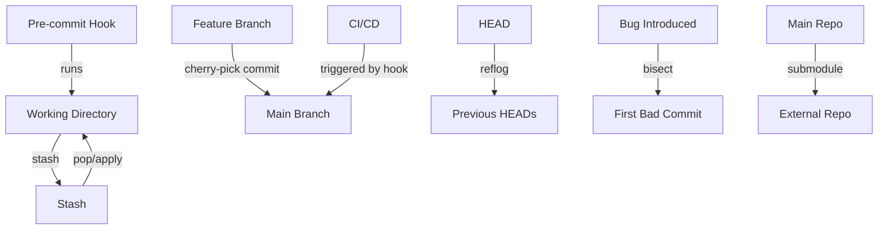
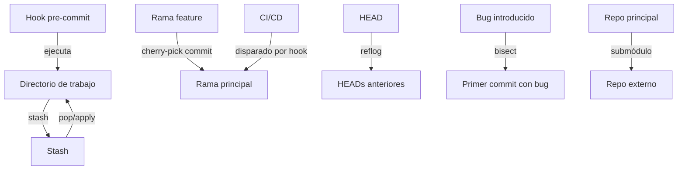

# 05 - Advanced Git Topics / Temas Avanzados de Git

<details>
<summary><strong>English</strong></summary>

## Theory: Advanced Git Concepts
- **git stash:** Temporarily shelves (or stashes) changes you've made to your working directory so you can work on something else, then come back and re-apply them later. Stashes can be named, listed, applied selectively, and even applied to other branches. Useful for context switching and avoiding dirty working trees.
- **git cherry-pick:** Apply the changes introduced by some existing commits. Useful for copying individual commits from one branch to another, especially for hotfixes or backporting features. Handles conflicts like a merge and can be used with ranges or multiple commits.
- **git reflog:** Shows a log of where your HEAD and branch references have been. Essential for recovering lost commits, branches, or undoing mistakes. Each action (checkout, commit, reset, rebase) is logged, making it a powerful safety net.
- **git bisect:** Helps you find the commit that introduced a bug by binary search. Automates the process of checking out commits and marking them as good or bad, drastically reducing the time to find regressions in large histories.
- **Git hooks:** Scripts that run automatically at certain points in Git's execution, such as before a commit or after a merge. Useful for enforcing policies (e.g., commit message style), running tests, formatting code, or automating deployments. Hooks are local by default but can be shared via templates or tools.
- **Submodules:** Allow you to keep a Git repository as a subdirectory of another Git repository. Useful for including external dependencies, libraries, or shared code. Submodules have their own history and must be updated explicitly. Managing submodules requires care to avoid version mismatches.

## Essential Commands
| Command | Description |
|---------|-------------|
| `git stash` | Stash your local changes. |
| `git stash save "message"` | Stash with a custom message for easier identification. |
| `git stash pop` | Re-apply the most recent stash and remove it from the stash list. |
| `git stash apply stash@{n}` | Apply a specific stash without removing it. |
| `git stash list` | List all stashed changes. |
| `git stash drop stash@{n}` | Delete a specific stash. |
| `git cherry-pick <commit>` | Apply a specific commit from another branch. |
| `git cherry-pick <commit1> <commit2>` | Apply multiple commits. |
| `git cherry-pick A^..B` | Apply a range of commits. |
| `git reflog` | Show the history of HEAD and branch changes. |
| `git bisect start` | Begin a bisect session to find a bad commit. |
| `git bisect good <commit>` | Mark a commit as good. |
| `git bisect bad <commit>` | Mark a commit as bad. |
| `git bisect run <cmd>` | Automate bisect with a test script. |
| `git bisect reset` | End bisect and return to original HEAD. |
| `git submodule add <repo> <path>` | Add a submodule. |
| `git submodule update --init` | Initialize and fetch submodules. |
| `git submodule update --remote` | Update submodules to latest commit on their tracked branch. |
| `git submodule foreach <cmd>` | Run a command in each submodule. |

## Visual: Advanced Workflow


## Practical Examples
### Stashing Changes
```bash
git stash save "WIP: refactor login" # Save changes with a message
git stash list # See stashes
git stash show -p stash@{0} # Show details of a stash
git stash pop # Re-apply last stash
git stash apply stash@{1} # Apply a specific stash
git stash drop stash@{1} # Remove a specific stash
```
### Cherry-picking a Commit
```bash
git checkout main
git cherry-pick <commit-hash> # Apply a single commit
git cherry-pick <commit1> <commit2> # Apply multiple commits
git cherry-pick A^..B # Apply a range of commits
```
### Using Reflog to Recover a Commit
```bash
git reflog # Find lost commit
git checkout <commit-hash> # Restore lost commit
git branch recovered <commit-hash> # Create a branch from lost commit
```
### Bisecting to Find a Bug
```bash
git bisect start
git bisect bad # Mark current as bad
git bisect good <commit-hash> # Mark a commit as good
# Test and mark each step as good/bad
git bisect run ./test-script.sh # Automate with a script
git bisect reset # End session
```
### Adding and Managing Submodules
```bash
git submodule add https://github.com/example/lib.git libs/lib
git submodule update --init --recursive # Initialize all submodules
git submodule update --remote # Update to latest commit
git submodule foreach git pull # Update all submodules
```
### Using Git Hooks
- Create a file in `.git/hooks/pre-commit` and make it executable:
```bash
echo "#!/bin/sh\necho 'Running pre-commit checks...'" > .git/hooks/pre-commit
chmod +x .git/hooks/pre-commit
```

## Best Practices
- Use `git stash` to keep your working directory clean when switching tasks. Name your stashes for clarity.
- Use `cherry-pick` sparingly to avoid complex histories and always resolve conflicts carefully.
- Regularly check `reflog` if you think you've lost work. Use it to recover lost branches or commits.
- Use `bisect` for efficient debugging in large projects. Automate with scripts for faster results.
- Document and version control your Git hooks using a hooks template or by storing them in the repository and symlinking.
- Keep submodules updated, pin them to specific commits, and document their purpose and usage in your README.
- Always run `git submodule update --init --recursive` after cloning a repo with submodules.

## Common Mistakes
- Forgetting to apply or drop stashes, leading to confusion and lost work.
- Cherry-picking merge commits without understanding the consequences, which can lead to complex conflicts.
- Not resetting bisect, leaving the repo in a detached state and causing confusion.
- Ignoring submodule updates, causing build failures or outdated dependencies.
- Overwriting hooks without backup, losing important automation or checks.
- Not documenting submodule usage, confusing collaborators.
- Not making hooks executable, causing them to silently fail.

</details>

<details>
<summary><strong>Español</strong></summary>

## Teoría: Conceptos Avanzados de Git
- **git stash:** Guarda temporalmente los cambios en tu directorio de trabajo para que puedas cambiar de tarea y luego recuperarlos. Los stashes pueden tener nombre, listarse, aplicarse selectivamente e incluso aplicarse en otras ramas. Muy útil para cambiar de contexto y evitar árboles de trabajo sucios.
- **git cherry-pick:** Aplica los cambios de un commit específico en otra rama. Útil para copiar cambios puntuales, hotfixes o backports. Maneja conflictos como un merge y puede usarse con rangos o múltiples commits.
- **git reflog:** Muestra un historial de los movimientos de HEAD y referencias de ramas. Esencial para recuperar commits, ramas o deshacer errores. Cada acción (checkout, commit, reset, rebase) queda registrada, lo que lo convierte en una red de seguridad poderosa.
- **git bisect:** Permite encontrar el commit que introdujo un bug mediante búsqueda binaria. Automatiza el proceso de revisar commits y marcarlos como buenos o malos, reduciendo drásticamente el tiempo para encontrar regresiones.
- **Git hooks:** Scripts que se ejecutan automáticamente en ciertos puntos del flujo de Git, como antes de un commit o después de un merge. Útiles para forzar políticas (ej: formato de mensajes), correr tests, formatear código o automatizar despliegues. Los hooks son locales por defecto, pero pueden compartirse mediante plantillas o herramientas.
- **Submódulos:** Permiten incluir un repositorio Git como subdirectorio de otro. Útil para dependencias externas, librerías o código compartido. Los submódulos tienen su propio historial y deben actualizarse explícitamente. Su gestión requiere cuidado para evitar desincronizaciones.

## Comandos esenciales
| Comando | Descripción |
|---------|-------------|
| `git stash` | Guarda tus cambios locales. |
| `git stash save "mensaje"` | Guarda un stash con mensaje personalizado. |
| `git stash pop` | Aplica y elimina el último stash. |
| `git stash apply stash@{n}` | Aplica un stash específico sin eliminarlo. |
| `git stash list` | Lista todos los cambios guardados. |
| `git stash drop stash@{n}` | Elimina un stash específico. |
| `git cherry-pick <commit>` | Aplica un commit específico de otra rama. |
| `git cherry-pick <commit1> <commit2>` | Aplica varios commits. |
| `git cherry-pick A^..B` | Aplica un rango de commits. |
| `git reflog` | Muestra el historial de cambios de HEAD y ramas. |
| `git bisect start` | Inicia una sesión de bisect para encontrar un commit problemático. |
| `git bisect good <commit>` | Marca un commit como bueno. |
| `git bisect bad <commit>` | Marca un commit como malo. |
| `git bisect run <cmd>` | Automatiza bisect con un script de pruebas. |
| `git bisect reset` | Finaliza bisect y vuelve al HEAD original. |
| `git submodule add <repo> <ruta>` | Agrega un submódulo. |
| `git submodule update --init` | Inicializa y descarga submódulos. |
| `git submodule update --remote` | Actualiza submódulos al último commit de su rama. |
| `git submodule foreach <cmd>` | Ejecuta un comando en cada submódulo. |

## Visual: Flujo Avanzado


## Ejemplos prácticos
### Guardar cambios con Stash
```bash
git stash save "WIP: refactor login" # Guarda cambios con mensaje
git stash list # Ver stashes
git stash show -p stash@{0} # Ver detalles de un stash
git stash pop # Recupera el último stash
git stash apply stash@{1} # Aplica un stash específico
git stash drop stash@{1} # Elimina un stash específico
```
### Cherry-pick de un commit
```bash
git checkout main
git cherry-pick <hash-del-commit> # Aplica un commit
git cherry-pick <commit1> <commit2> # Aplica varios commits
git cherry-pick A^..B # Aplica un rango de commits
```
### Recuperar un commit con Reflog
```bash
git reflog # Buscar commit perdido
git checkout <hash-del-commit> # Restaurar commit perdido
git branch recuperada <hash-del-commit> # Crear rama desde commit perdido
```
### Usar Bisect para encontrar un bug
```bash
git bisect start
git bisect bad # Marca el actual como malo
git bisect good <hash-del-commit> # Marca uno bueno
# Prueba y marca cada paso como bueno/malo
git bisect run ./test-script.sh # Automatiza con script
git bisect reset # Finaliza la sesión
```
### Agregar y gestionar submódulos
```bash
git submodule add https://github.com/example/lib.git libs/lib
git submodule update --init --recursive # Inicializa todos los submódulos
git submodule update --remote # Actualiza al último commit
git submodule foreach git pull # Actualiza todos los submódulos
```
### Usar Git Hooks
- Crea un archivo en `.git/hooks/pre-commit` y hazlo ejecutable:
```bash
echo "#!/bin/sh\necho 'Ejecutando pre-commit...'" > .git/hooks/pre-commit
chmod +x .git/hooks/pre-commit
```

## Mejores prácticas
- Usa `git stash` para mantener limpio tu directorio de trabajo al cambiar de tarea. Nombra tus stashes para mayor claridad.
- Usa `cherry-pick` con precaución para evitar historiales complejos y resuelve los conflictos cuidadosamente.
- Consulta `reflog` si crees que perdiste trabajo. Úsalo para recuperar ramas o commits perdidos.
- Usa `bisect` para depurar eficientemente en proyectos grandes. Automatiza con scripts para mayor rapidez.
- Documenta y versiona tus hooks de Git usando plantillas o almacenándolos en el repositorio y enlazando con symlinks.
- Mantén los submódulos actualizados, pínalos a commits específicos y documenta su propósito y uso en el README.
- Siempre ejecuta `git submodule update --init --recursive` tras clonar un repo con submódulos.

## Errores comunes
- Olvidar aplicar o eliminar stashes, generando confusión y pérdida de trabajo.
- Cherry-pick de commits de merge sin entender las consecuencias, lo que puede generar conflictos complejos.
- No resetear bisect, dejando el repo en estado detached y causando confusión.
- Ignorar actualizaciones de submódulos, causando fallos o dependencias desactualizadas.
- Sobrescribir hooks sin respaldo, perdiendo automatizaciones o chequeos importantes.
- No documentar el uso de submódulos, confundiendo a colaboradores.
- No hacer ejecutables los hooks, haciendo que fallen silenciosamente.

</details>

---

## Practical Exercises / Ejercicios Prácticos
<details>
<summary><strong>English</strong></summary>

**Exercise 1:** Stash your changes, switch branches, and re-apply them. Try naming your stash and applying it to a different branch.
<details><summary>Solution</summary>

```bash
git stash save "WIP: feature-x"
git checkout other-branch
git stash list
git stash apply stash@{0}
```
</details>

**Exercise 2:** Cherry-pick a commit or a range of commits from a feature branch to main. Resolve any conflicts that arise.
<details><summary>Solution</summary>

```bash
git checkout main
git cherry-pick <commit-hash>
# If conflicts, resolve and git cherry-pick --continue
```
</details>

**Exercise 3:** Use reflog to recover a lost commit and create a new branch from it.
<details><summary>Solution</summary>

```bash
git reflog
git checkout <commit-hash>
git branch recovered <commit-hash>
```
</details>

**Exercise 4:** Use bisect to find a bug, automating with a test script if possible.
<details><summary>Solution</summary>

```bash
git bisect start
git bisect bad
git bisect good <commit-hash>
git bisect run ./test-script.sh
git bisect reset
```
</details>

**Exercise 5:** Add, initialize, and update a submodule. Document its purpose in your README.
<details><summary>Solution</summary>

```bash
git submodule add https://github.com/example/lib.git libs/lib
git submodule update --init --recursive
git submodule update --remote
```
</details>

**Exercise 6:** Create a pre-commit hook that checks for TODO comments in staged files and blocks the commit if any are found.
<details><summary>Solution</summary>

Create `.git/hooks/pre-commit`:
```bash
#!/bin/sh
git diff --cached | grep -i TODO && { echo 'Remove TODOs before committing!'; exit 1; } || exit 0
```
Make it executable:
```bash
chmod +x .git/hooks/pre-commit
```
</details>

</details>
<details>
<summary><strong>Español</strong></summary>

**Ejercicio 1:** Guarda tus cambios, cambia de rama y recupéralos. Prueba nombrar tu stash y aplicarlo en otra rama.
<details><summary>Solución</summary>

```bash
git stash save "WIP: feature-x"
git checkout otra-rama
git stash list
git stash apply stash@{0}
```
</details>

**Ejercicio 2:** Aplica un commit o un rango de commits de una rama feature a main con cherry-pick. Resuelve cualquier conflicto.
<details><summary>Solución</summary>

```bash
git checkout main
git cherry-pick <hash-del-commit>
# Si hay conflictos, resuélvelos y git cherry-pick --continue
```
</details>

**Ejercicio 3:** Recupera un commit perdido usando reflog y crea una nueva rama desde él.
<details><summary>Solución</summary>

```bash
git reflog
git checkout <hash-del-commit>
git branch recuperada <hash-del-commit>
```
</details>

**Ejercicio 4:** Usa bisect para encontrar un bug, automatizando con un script de pruebas si es posible.
<details><summary>Solución</summary>

```bash
git bisect start
git bisect bad
git bisect good <hash-del-commit>
git bisect run ./test-script.sh
git bisect reset
```
</details>

**Ejercicio 5:** Agrega, inicializa y actualiza un submódulo. Documenta su propósito en tu README.
<details><summary>Solución</summary>

```bash
git submodule add https://github.com/example/lib.git libs/lib
git submodule update --init --recursive
git submodule update --remote
```
</details>

**Ejercicio 6:** Crea un hook pre-commit que busque comentarios TODO en los archivos staged y bloquee el commit si encuentra alguno.
<details><summary>Solución</summary>

Crea `.git/hooks/pre-commit`:
```bash
#!/bin/sh
git diff --cached | grep -i TODO && { echo '¡Elimina los TODOs antes de commitear!'; exit 1; } || exit 0
```
Hazlo ejecutable:
```bash
chmod +x .git/hooks/pre-commit
```
</details>

</details>

---

## FAQ / Preguntas Frecuentes
<details>
<summary><strong>English</strong></summary>

- **What happens if I forget to pop a stash?**
  - The stash remains in the list. Use `git stash list` to see all stashes and `git stash pop` or `git stash drop` to manage them. Stashes are not deleted automatically and can be applied to any branch.
- **Can I cherry-pick multiple commits?**
  - Yes, use `git cherry-pick <commit1> <commit2> ...` or a range: `git cherry-pick A^..B`. Be careful with conflicts and commit order.
- **How do I recover a branch I deleted?**
  - Use `git reflog` to find the commit and `git checkout -b <branch> <commit-hash>`. Reflog keeps history for 90 days by default.
- **What are common uses for hooks?**
  - Enforcing commit message formats, running tests before push, formatting code, or automating deployments. Hooks can be shared using templates or tools like Husky.
- **How do I update submodules after cloning?**
  - Run `git submodule update --init --recursive` to initialize and fetch all submodules. Use `git submodule update --remote` to get the latest changes.
- **Can I remove a submodule?**
  - Yes, remove the submodule entry from `.gitmodules`, delete the submodule directory, and run `git rm --cached <path>`.
- **How do I share hooks with my team?**
  - Store hook scripts in the repo (e.g., in a `hooks/` folder) and use a setup script to symlink them to `.git/hooks/`.
</details>
<details>
<summary><strong>Español</strong></summary>

- **¿Qué pasa si olvido aplicar un stash?**
  - El stash queda en la lista. Usa `git stash list` para verlos y `git stash pop` o `git stash drop` para gestionarlos. Los stashes no se eliminan automáticamente y pueden aplicarse en cualquier rama.
- **¿Puedo hacer cherry-pick de varios commits?**
  - Sí, usa `git cherry-pick <commit1> <commit2> ...` o un rango: `git cherry-pick A^..B`. Ten cuidado con los conflictos y el orden de los commits.
- **¿Cómo recupero una rama borrada?**
  - Usa `git reflog` para encontrar el commit y `git checkout -b <rama> <hash-del-commit>`. El reflog guarda el historial por 90 días por defecto.
- **¿Para qué sirven los hooks?**
  - Para forzar formatos de mensajes, correr tests antes de push, formatear código o automatizar despliegues. Los hooks pueden compartirse usando plantillas o herramientas como Husky.
- **¿Cómo actualizo submódulos tras clonar?**
  - Ejecuta `git submodule update --init --recursive` para inicializar y descargar todos los submódulos. Usa `git submodule update --remote` para obtener los últimos cambios.
- **¿Puedo eliminar un submódulo?**
  - Sí, elimina la entrada en `.gitmodules`, borra el directorio y ejecuta `git rm --cached <ruta>`.
