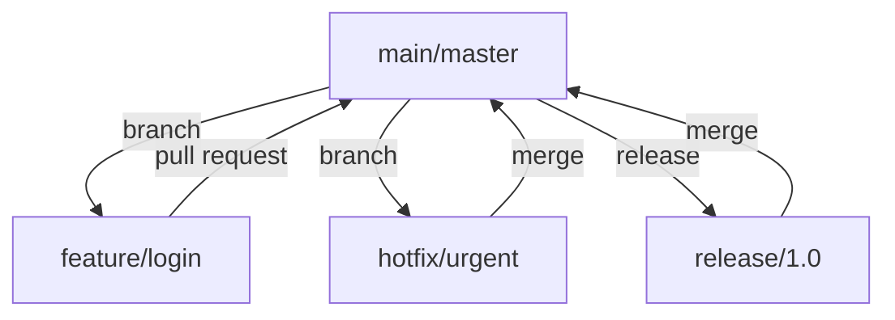
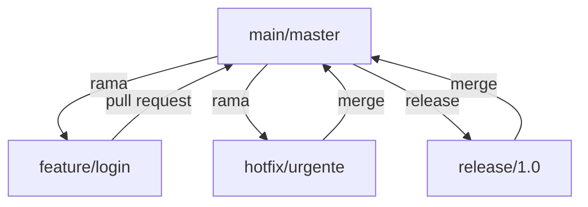

# 06 - Best Practices / Mejores Prácticas

<details>
<summary><strong>English</strong></summary>

## Theory: Why Best Practices Matter
- Best practices in Git help teams collaborate efficiently, maintain a clean history, avoid common pitfalls, and ensure code quality and security.
- Following conventions and workflows reduces confusion, speeds up onboarding, and prevents costly mistakes.

## Workflows
- **Feature Branch Workflow:** Each new feature or bugfix is developed in its own branch, then merged into main via pull request. Encourages code review and parallel development.
- **Git Flow:** A branching model with dedicated branches for features, releases, hotfixes, and development. Useful for projects with regular releases.
- **Trunk-Based Development:** All developers commit to a single main branch, using short-lived feature branches or direct commits. Promotes continuous integration and rapid delivery.

### Visual: Common Workflows


## Commit Message Conventions
- Use clear, concise messages that describe what and why, not just how.
- Common formats:
  - **Conventional Commits:** `type(scope): description` (e.g., `feat(auth): add login endpoint`)
  - **Imperative Mood:** "Fix bug" not "Fixed bug" or "Fixes bug"
- Reference issues or tickets when relevant (e.g., `fix: correct typo in README (#42)`).
- Separate subject and body with a blank line. Limit subject to 50 characters.

### Example Commit Messages
```
feat(ui): add dark mode toggle
fix(api): handle null user in login (#123)
docs: update contributing guidelines
```

## .gitignore and Repository Hygiene
- Use `.gitignore` to exclude files that should not be tracked (build artifacts, secrets, IDE configs).
- Keep the repository clean: remove unused files, avoid committing dependencies or generated files.
- Regularly review and update `.gitignore` as the project evolves.
- Use [gitignore.io](https://www.toptal.com/developers/gitignore) to generate templates for your stack.

## Security and Sensitive Data
- **Never commit secrets:** Use environment variables or secret managers for API keys, passwords, and credentials.
- Add `.env`, `*.pem`, and similar files to `.gitignore`.
- Use tools like [git-secrets](https://github.com/awslabs/git-secrets) or [truffleHog](https://github.com/trufflesecurity/trufflehog) to scan for sensitive data.
- If you accidentally commit a secret, rotate it immediately and remove it from history with `git filter-branch` or `git filter-repo`.

## Anti-patterns and Troubleshooting
- Avoid force-pushing to shared branches (`main`, `develop`).
- Don’t commit large binaries or dependencies; use Git LFS or package managers.
- Don’t rewrite public history unless absolutely necessary.
- Use `git status` and `git log` frequently to understand your repo state.
- If you get stuck, use `git reflog` to recover lost work.

## Best Practices Checklist
- [x] Use descriptive branch names (e.g., `feature/signup-form`)
- [x] Write meaningful commit messages
- [x] Keep branches short-lived and focused
- [x] Review code via pull requests
- [x] Protect main branches with rules
- [x] Regularly prune old branches
- [x] Use `.gitignore` and avoid committing secrets
- [x] Automate tests and checks with CI/CD

</details>

<details>
<summary><strong>Español</strong></summary>

## Teoría: Por qué importan las buenas prácticas
- Las buenas prácticas en Git ayudan a los equipos a colaborar eficientemente, mantener un historial limpio, evitar errores comunes y asegurar la calidad y seguridad del código.
- Seguir convenciones y flujos de trabajo reduce la confusión, acelera la integración de nuevos miembros y previene errores costosos.

## Flujos de trabajo
- **Feature Branch Workflow:** Cada nueva funcionalidad o corrección se desarrolla en su propia rama y luego se fusiona a main mediante pull request. Fomenta la revisión de código y el desarrollo paralelo.
- **Git Flow:** Modelo de ramas con ramas dedicadas para features, releases, hotfixes y desarrollo. Útil para proyectos con lanzamientos regulares.
- **Trunk-Based Development:** Todos los desarrolladores trabajan sobre una sola rama principal, usando ramas de vida corta o commits directos. Promueve integración continua y entregas rápidas.

### Visual: Flujos comunes


## Convenciones de mensajes de commit
- Usa mensajes claros y concisos que describan qué y por qué, no solo cómo.
- Formatos comunes:
  - **Conventional Commits:** `type(scope): descripción` (ej: `feat(auth): agregar endpoint de login`)
  - **Modo imperativo:** "Corrige bug" en vez de "Corregido bug" o "Corrigiendo bug"
- Referencia issues o tickets cuando sea relevante (ej: `fix: corrige typo en README (#42)`).
- Separa el asunto y el cuerpo con una línea en blanco. Limita el asunto a 50 caracteres.

### Ejemplo de mensajes de commit
```
feat(ui): agregar toggle de modo oscuro
fix(api): manejar usuario null en login (#123)
docs: actualizar guía de contribución
```

## .gitignore e higiene del repositorio
- Usa `.gitignore` para excluir archivos que no deben ser versionados (builds, secretos, configuraciones de IDE).
- Mantén el repositorio limpio: elimina archivos no usados, evita subir dependencias o archivos generados.
- Revisa y actualiza `.gitignore` regularmente según evolucione el proyecto.
- Usa [gitignore.io](https://www.toptal.com/developers/gitignore) para generar plantillas según tu stack.

## Seguridad y datos sensibles
- **Nunca subas secretos:** Usa variables de entorno o gestores de secretos para claves, contraseñas y credenciales.
- Agrega `.env`, `*.pem` y archivos similares a `.gitignore`.
- Usa herramientas como [git-secrets](https://github.com/awslabs/git-secrets) o [truffleHog](https://github.com/trufflesecurity/trufflehog) para escanear datos sensibles.
- Si subiste un secreto por error, rotálo de inmediato y elimínalo del historial con `git filter-branch` o `git filter-repo`.

## Anti-patrones y resolución de problemas
- Evita hacer force-push a ramas compartidas (`main`, `develop`).
- No subas binarios grandes ni dependencias; usa Git LFS o gestores de paquetes.
- No reescribas el historial público salvo que sea absolutamente necesario.
- Usa `git status` y `git log` frecuentemente para entender el estado del repo.
- Si te trabas, usa `git reflog` para recuperar trabajo perdido.

## Checklist de buenas prácticas
- [x] Usa nombres descriptivos de ramas (ej: `feature/formulario-signup`)
- [x] Escribe mensajes de commit significativos
- [x] Mantén ramas cortas y enfocadas
- [x] Revisa código mediante pull requests
- [x] Protege ramas principales con reglas
- [x] Prunea ramas viejas regularmente
- [x] Usa `.gitignore` y evita subir secretos
- [x] Automatiza tests y chequeos con CI/CD

</details>

---

## Practical Exercises / Ejercicios Prácticos
<details>
<summary><strong>English</strong></summary>

**Exercise 1:** Create a feature branch, make a commit with a conventional message, and open a pull request.
<details><summary>Solution</summary>

```bash
git checkout -b feature/user-profile
# Make changes
git add .
git commit -m "feat(user): add user profile page"
git push origin feature/user-profile
# Open a pull request on your platform
```
</details>

**Exercise 2:** Add a `.gitignore` for your stack and test that ignored files are not tracked.
<details><summary>Solution</summary>

```bash
curl -L -o .gitignore https://www.toptal.com/developers/gitignore/api/node,windows,visualstudiocode
# Create a file to ignore, e.g., .env
echo "SECRET_KEY=123" > .env
git status # .env should not appear
```
</details>

**Exercise 3:** Simulate committing a secret and remove it from history.
<details><summary>Solution</summary>

```bash
git add secret.txt
git commit -m "add secret (mistake)"
git filter-branch --force --index-filter 'git rm --cached --ignore-unmatch secret.txt' --prune-empty --tag-name-filter cat -- --all
git push origin --force --all
```
</details>

</details>
<details>
<summary><strong>Español</strong></summary>

**Ejercicio 1:** Crea una rama feature, haz un commit con mensaje convencional y abre un pull request.
<details><summary>Solución</summary>

```bash
git checkout -b feature/perfil-usuario
# Realiza cambios
git add .
git commit -m "feat(usuario): agregar página de perfil"
git push origin feature/perfil-usuario
# Abre un pull request en tu plataforma
```
</details>

**Ejercicio 2:** Agrega un `.gitignore` para tu stack y prueba que los archivos ignorados no se suben.
<details><summary>Solución</summary>

```bash
curl -L -o .gitignore https://www.toptal.com/developers/gitignore/api/node,windows,visualstudiocode
# Crea un archivo a ignorar, ej: .env
echo "SECRET_KEY=123" > .env
git status # .env no debe aparecer
```
</details>

**Ejercicio 3:** Simula subir un secreto y elimínalo del historial.
<details><summary>Solución</summary>

```bash
git add secreto.txt
git commit -m "subir secreto (error)"
git filter-branch --force --index-filter 'git rm --cached --ignore-unmatch secreto.txt' --prune-empty --tag-name-filter cat -- --all
git push origin --force --all
```
</details>

</details>

---

## Real-World Workflow Example / Ejemplo de Flujo Real
<details>
<summary><strong>English</strong></summary>

### Complete Feature Branch Cycle
1. Create a new branch: `git checkout -b feature/payment-integration`
2. Make changes and commit with a descriptive message.
3. Push the branch: `git push origin feature/payment-integration`
4. Open a pull request (PR) and request review.
5. Automated CI/CD runs tests and checks.
6. Reviewer requests changes or approves.
7. Merge PR into `main` (preferably using "Squash and Merge" for a clean history).
8. Delete the feature branch after merge.

### Example `.gitignore` for Node.js
```
# Node
node_modules/
dist/
.env
npm-debug.log*
.DS_Store
```

### Branch Protection Example (GitHub)
- Go to Settings > Branches > Add rule for `main`:
  - Require pull request reviews before merging
  - Require status checks to pass before merging
  - Restrict who can push to matching branches

### CI/CD Integration Example (GitHub Actions)
Create `.github/workflows/ci.yml`:
```yaml
name: CI
on: [push, pull_request]
jobs:
  build:
    runs-on: ubuntu-latest
    steps:
      - uses: actions/checkout@v3
      - name: Install deps
        run: npm install
      - name: Run tests
        run: npm test
```

### Example `CONTRIBUTING.md` Excerpt
```
## How to Contribute
- Fork the repository and create a feature branch.
- Follow commit message conventions.
- Ensure all tests pass before submitting a PR.
- Describe your changes clearly in the PR description.
```

### Common Errors and Recovery
- **Accidentally deleted a branch:**
  - Use `git reflog` to find the last commit and `git checkout -b branchname <commit>`
- **Committed to the wrong branch:**
  - Use `git cherry-pick` to move commits, or `git rebase -i` to edit history.
- **Pushed a secret:**
  - Rotate the secret, remove from history, and notify your team.

</details>
<details>
<summary><strong>Español</strong></summary>

### Ciclo completo de feature branch
1. Crea una nueva rama: `git checkout -b feature/integracion-pagos`
2. Realiza cambios y commitea con mensaje descriptivo.
3. Sube la rama: `git push origin feature/integracion-pagos`
4. Abre un pull request (PR) y pide revisión.
5. El CI/CD automático corre tests y chequeos.
6. El revisor pide cambios o aprueba.
7. Fusiona el PR a `main` (preferentemente usando "Squash and Merge" para un historial limpio).
8. Borra la rama feature tras el merge.

### Ejemplo de `.gitignore` para Node.js
```
# Node
node_modules/
dist/
.env
npm-debug.log*
.DS_Store
```

### Ejemplo de protección de ramas (GitHub)
- Ve a Configuración > Ramas > Agrega regla para `main`:
  - Requiere revisiones de PR antes de fusionar
  - Requiere que los checks pasen antes de fusionar
  - Restringe quién puede pushear a esas ramas

### Integración CI/CD (GitHub Actions)
Crea `.github/workflows/ci.yml`:
```yaml
name: CI
on: [push, pull_request]
jobs:
  build:
    runs-on: ubuntu-latest
    steps:
      - uses: actions/checkout@v3
      - name: Instalar dependencias
        run: npm install
      - name: Correr tests
        run: npm test
```

### Ejemplo de `CONTRIBUTING.md`
```
## Cómo contribuir
- Haz fork del repositorio y crea una rama feature.
- Sigue las convenciones de mensajes de commit.
- Asegúrate de que todos los tests pasen antes de enviar el PR.
- Describe claramente tus cambios en la descripción del PR.
```

### Errores comunes y recuperación
- **Borré una rama por error:**
  - Usa `git reflog` para encontrar el último commit y `git checkout -b rama <commit>`
- **Commiteé en la rama equivocada:**
  - Usa `git cherry-pick` para mover commits, o `git rebase -i` para editar el historial.
- **Subí un secreto:**
  - Rota el secreto, elimínalo del historial y avisa a tu equipo.

</details>

---

## FAQ / Preguntas Frecuentes
<details>
<summary><strong>English</strong></summary>

- **What is the best workflow for my team?**
  - It depends on your project size, release cadence, and team experience. Feature branch is simple; Git Flow is robust for releases; trunk-based is best for rapid delivery.
- **How do I enforce commit message conventions?**
  - Use commit hooks or tools like [commitlint](https://commitlint.js.org/).
- **How do I recover from a force-push mistake?**
  - Use `git reflog` to find the lost commit and reset or create a new branch from it.
- **How do I keep my repo clean?**
  - Regularly prune branches, use `.gitignore`, and review large files with `git lfs track`.
- **What if I accidentally commit a secret?**
  - Rotate the secret, remove it from history, and notify your team.

</details>
<details>
<summary><strong>Español</strong></summary>

- **¿Cuál es el mejor flujo de trabajo para mi equipo?**
  - Depende del tamaño del proyecto, la frecuencia de releases y la experiencia del equipo. Feature branch es simple; Git Flow es robusto para releases; trunk-based es ideal para entregas rápidas.
- **¿Cómo fuerzo convenciones de mensajes de commit?**
  - Usa hooks de commit o herramientas como [commitlint](https://commitlint.js.org/).
- **¿Cómo recupero un error tras un force-push?**
  - Usa `git reflog` para encontrar el commit perdido y haz reset o crea una nueva rama desde ahí.
- **¿Cómo mantengo limpio mi repo?**
  - Prunea ramas regularmente, usa `.gitignore` y revisa archivos grandes con `git lfs track`.
- **¿Qué hago si subí un secreto por error?**
  - Rota el secreto, elimínalo del historial y avisa a tu equipo.

</details>

---

## References / Referencias
- [GitHub Flow](https://docs.github.com/en/get-started/quickstart/github-flow)
- [Atlassian Git Flow](https://www.atlassian.com/git/tutorials/comparing-workflows/gitflow-workflow)
- [Trunk-Based Development](https://trunkbaseddevelopment.com/)
- [Conventional Commits](https://www.conventionalcommits.org/)
- [gitignore.io](https://www.toptal.com/developers/gitignore)
- [git-secrets](https://github.com/awslabs/git-secrets)
- [truffleHog](https://github.com/trufflesecurity/trufflehog)
- [commitlint](https://commitlint.js.org/)

---
