# 07 - Visualizations / Visualizaciones

<details>
<summary><strong>English</strong></summary>

## Theory: Why Visualizations Matter
- Visual representations help understand complex Git operations, workflows, and repository states.
- Diagrams clarify branching, merging, rebasing, and the internal structure of Git.
- Animated gifs and step-by-step visuals make abstract concepts concrete and easier to remember.

## Flowcharts and Diagrams
### Basic Branching and Merging
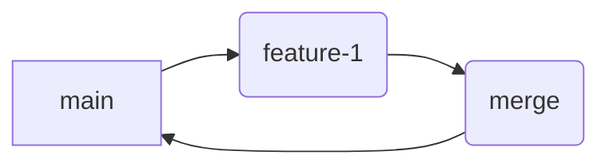

### Rebase vs Merge
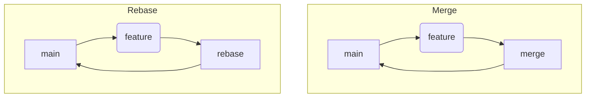

### Git Internals: Commits and Pointers
```mermaid
flowchart LR
  W[Working Directory] --> I[Index (Staging)]
  I --> R[Repository]
  R --> C1(Commit 1)
  C1 --> C2(Commit 2)
  C2 --> HEAD
```

## Animated Visuals (Description)
- **Branching:** Imagine a timeline splitting into two lines—each line is a branch. Changes can happen independently.
- **Merging:** Two lines join into one, combining changes from both.
- **Rebasing:** One line is "lifted" and replayed on top of another, creating a linear history.
- **Cherry-pick:** A single commit is "picked" from one line and applied to another.

## Example: Visualizing a Feature Branch Workflow
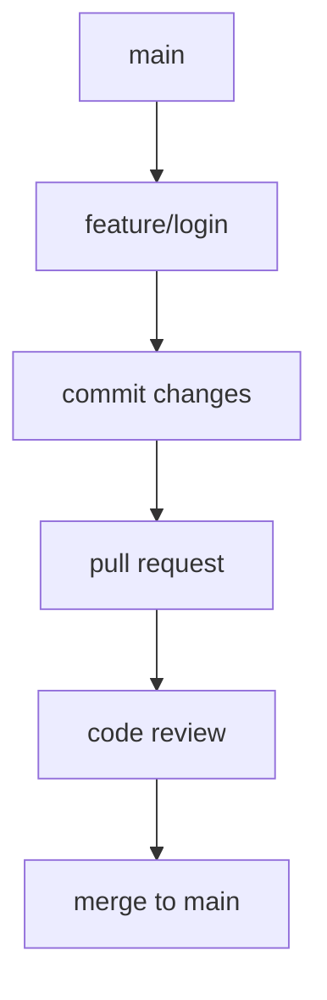

## Tools for Visualizing Git
- [Mermaid](https://mermaid-js.github.io/mermaid/#/)
- [GitKraken](https://www.gitkraken.com/)
- [Sourcetree](https://www.sourcetreeapp.com/)
- [Git Graph VS Code Extension](https://marketplace.visualstudio.com/items?itemName=mhutchie.git-graph)
- [Gource](https://gource.io/) (animated repo history)

</details>

<details>
<summary><strong>Español</strong></summary>

## Teoría: Por qué importan las visualizaciones
- Las representaciones visuales ayudan a entender operaciones complejas de Git, flujos de trabajo y estados del repositorio.
- Los diagramas aclaran branching, merging, rebase y la estructura interna de Git.
- Los gifs animados y visuales paso a paso hacen concretos conceptos abstractos y facilitan su memorización.

## Diagramas y flujogramas
### Branching y Merging básico


### Rebase vs Merge


### Internals de Git: Commits y punteros
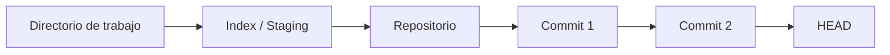

## Visuales animados (descripción)
- **Branching:** Imagina una línea de tiempo que se divide en dos—cada línea es una rama. Los cambios pueden ocurrir de forma independiente.
- **Merging:** Dos líneas se unen en una, combinando cambios de ambas.
- **Rebase:** Una línea se "levanta" y se reproduce sobre otra, creando un historial lineal.
- **Cherry-pick:** Un commit individual se "toma" de una línea y se aplica en otra.

## Ejemplo: Visualización de un flujo de feature branch
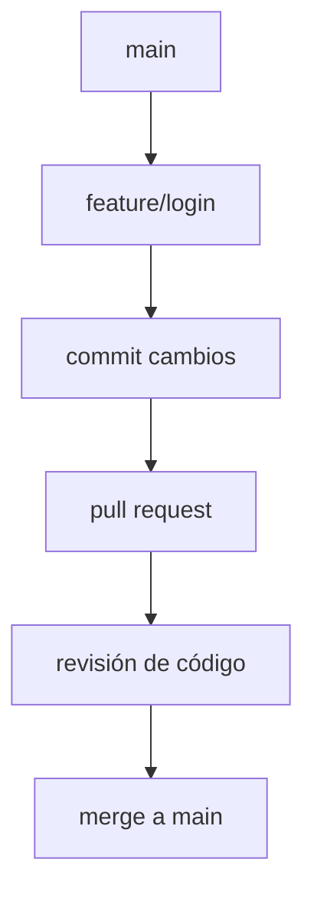

## Herramientas para visualizar Git
- [Mermaid](https://mermaid-js.github.io/mermaid/#/)
- [GitKraken](https://www.gitkraken.com/)
- [Sourcetree](https://www.sourcetreeapp.com/)
- [Git Graph VS Code Extension](https://marketplace.visualstudio.com/items?itemName=mhutchie.git-graph)
- [Gource](https://gource.io/) (historial animado del repo)

</details>

---

## Advanced Visualizations / Visualizaciones Avanzadas
<details>
<summary><strong>English</strong></summary>

### Visualizing Conflicts and Resolution
#### Before Merge Conflict
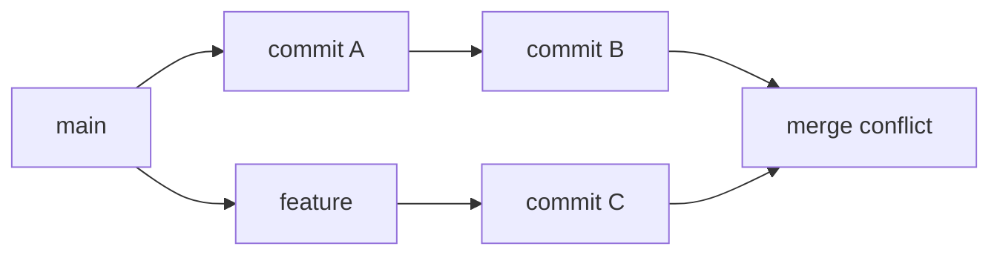
#### After Conflict Resolution
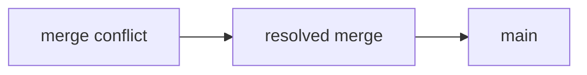

### Collaborative Workflow Example
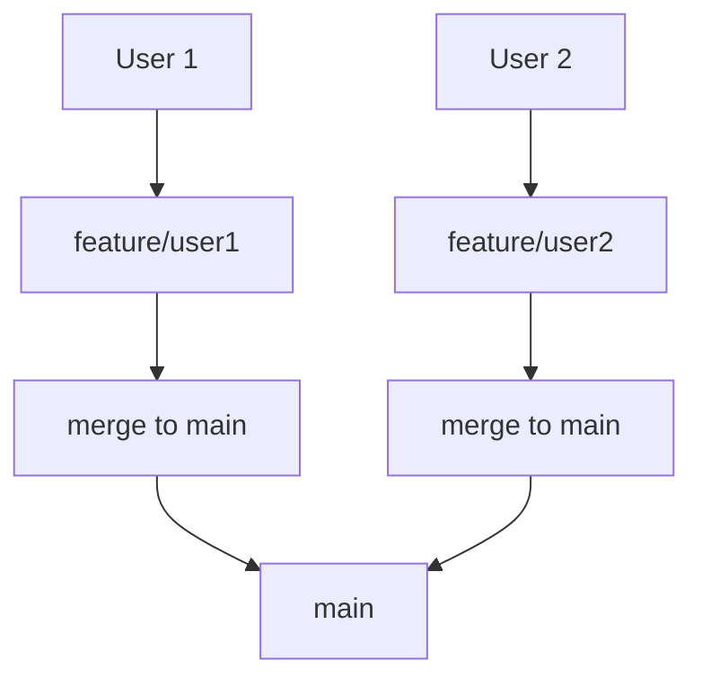

### Visualizing Reflog
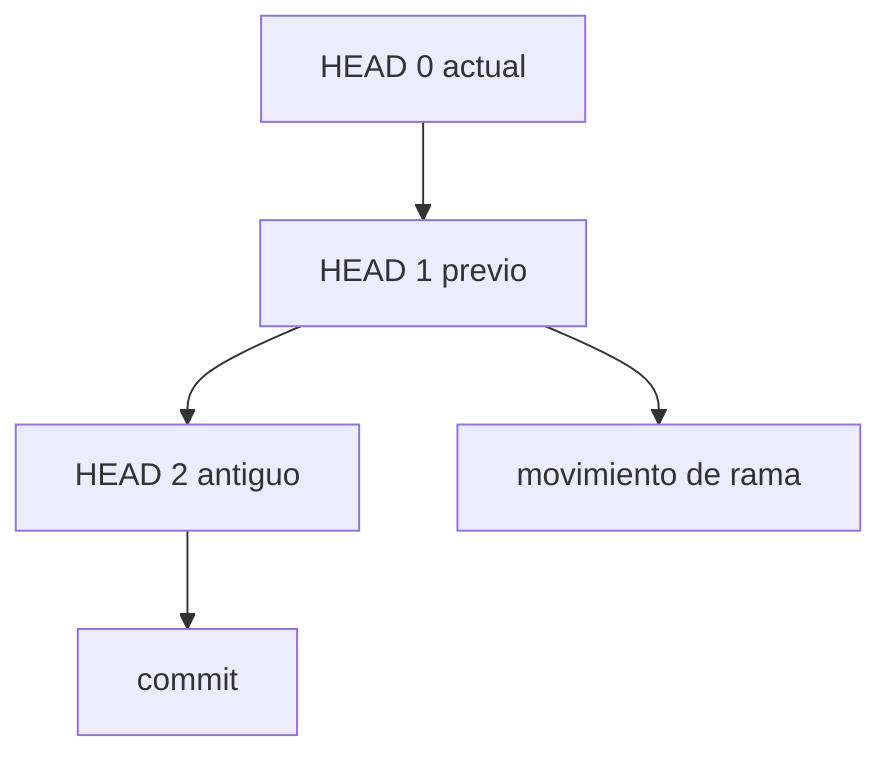

### Visualizing Stash
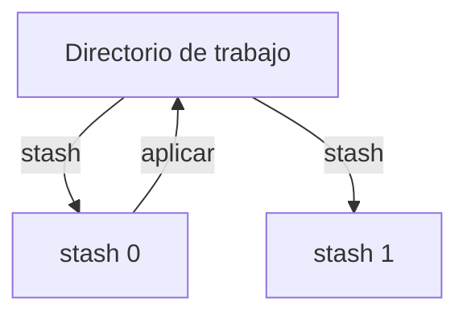

### Visualizing Submodules
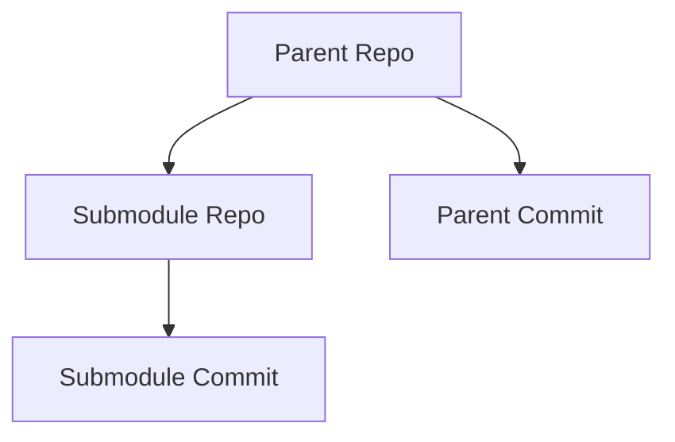

### Screenshots & Animations
- [GitKraken Example](https://www.gitkraken.com/learn/git/tutorials/visualizing-git-branches)
- [Gource Animation Example](https://gource.io/gallery/)
- [VS Code Git Graph Extension](https://marketplace.visualstudio.com/items?itemName=mhutchie.git-graph)

### FAQ: Visualizations
- **How do I interpret a merge conflict diagram?**
  - Look for branches converging on a node labeled as conflict; resolution creates a new commit.
- **What does a rebase look like visually?**
  - The feature branch is replayed on top of the main branch, resulting in a straight line.
- **How can I see my repo visually?**
  - Use tools like GitKraken, Sourcetree, or the Git Graph extension for VS Code.

</details>
<details>
<summary><strong>Español</strong></summary>

### Visualización de conflictos y resolución
#### Antes del conflicto de merge
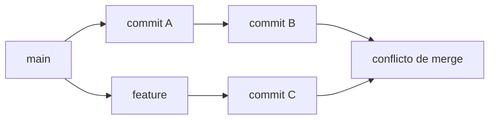
#### Después de resolver el conflicto
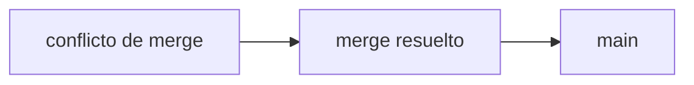

### Ejemplo de flujo colaborativo
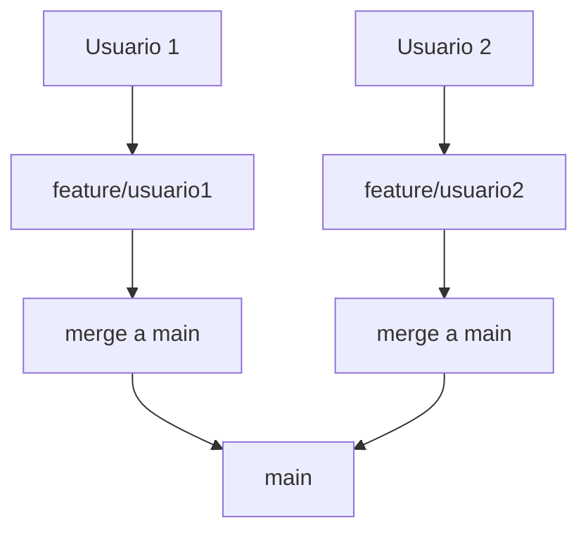

### Visualización de Reflog


### Visualización de Stash


### Visualización de Submódulos
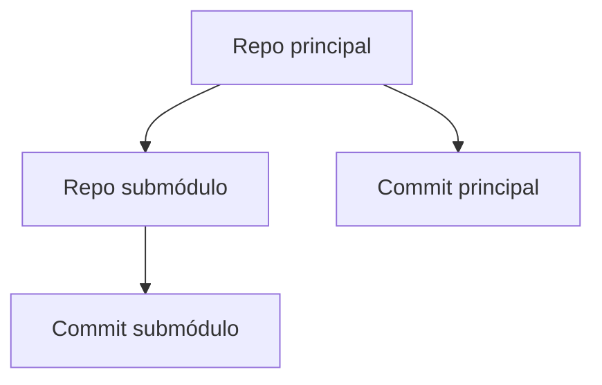

### Capturas y animaciones
- [Ejemplo GitKraken](https://www.gitkraken.com/learn/git/tutorials/visualizing-git-branches)
- [Ejemplo animación Gource](https://gource.io/gallery/)
- [Extensión Git Graph para VS Code](https://marketplace.visualstudio.com/items?itemName=mhutchie.git-graph)

### Preguntas frecuentes: Visualizaciones
- **¿Cómo interpreto un diagrama de conflicto de merge?**
  - Observa ramas que convergen en un nodo de conflicto; la resolución crea un nuevo commit.
- **¿Cómo se ve un rebase visualmente?**
  - La rama feature se "reproduce" sobre main, resultando en una línea recta.
- **¿Cómo puedo ver mi repo de forma visual?**
  - Usa herramientas como GitKraken, Sourcetree o la extensión Git Graph para VS Code.

</details>

---

## References / Referencias
- [A Visual Git Reference](https://marklodato.github.io/visual-git-guide/index-en.html)
- [Oh My Git! (interactive game)](https://ohmygit.org/)
- [Learn Git Branching (interactive)](https://learngitbranching.js.org/)
- [Gource](https://gource.io/)
- [Mermaid Live Editor](https://mermaid.live/)
